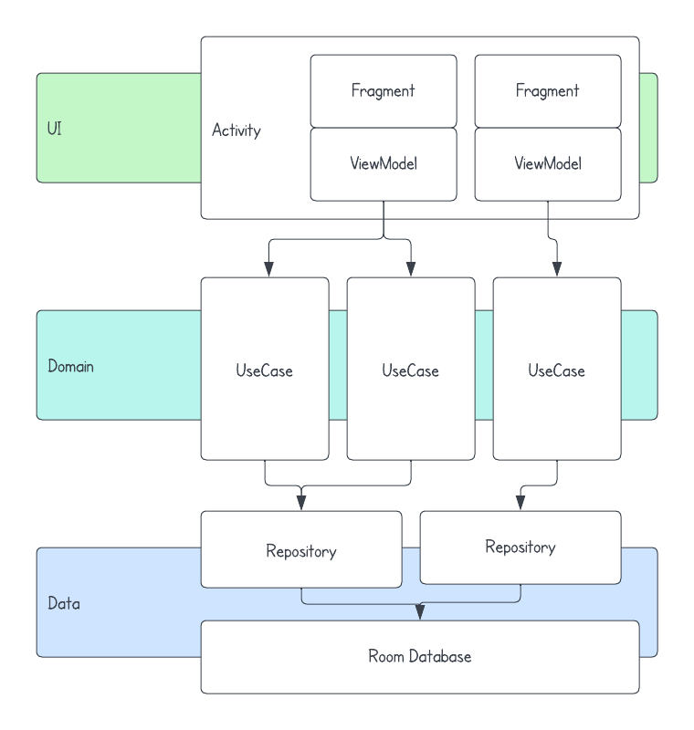

<h1 align="center">
    Android Notepad
    <br />
    <a href="https://github.com/cemtuver/android-notepad/releases">
        
    </a>
</h1>

Want to try it out?
<br />
The latest APK file is available on the [releases page](https://github.com/cemtuver/android-notepad/releases).

<table>
    <tr>
        <td>
            <p align="center">
                
            </p>
        </td>
        <td>
            <p align="center">
                
            </p>
        </td>
    </tr>
</table>

## Features
- List/add/edit/delete note
- Note background image from internet
- "[Medium.com](https://medium.com)" like typing experience
- Local data persistence
- Dark theme

## Architecture
<table>
    <tr>
        <td>
            <b>UI layer</b>
            <ul>
                <li>Fragments with single activity</li>
                <li>ViewModel</li>
                <li>LiveData</li>
                <li>Paging3</li>
                <li>Navigation</li>
                <li>Glide</li>
            </ul>
            <b>Domain layer</b>
            <ul>
                <li>UseCase</li>
            </ul>
            <b>Data layer</b>
            <ul>
                <li>Room</li>
                <li>Room paging</li>
            </ul>
            <b>Architectural components</b>
            <ul>
                <li>Kotlin</li>
                <li>Coroutines</li>
                <li>Hilt</li>
            </ul>
            <b>Testing</b>
            <ul>
                <li>Junit4</li>
                <li>Mockk</li>
            </ul>
        </td>
        <td>
            
        </td>
    </tr>
</table>
 
## Development
### Testing
The repository includes a comprehensive suite of JUnit4 unit tests that cover various aspects of the app, including view models, use cases, repositories, and mappers. The purpose of these tests is to ensure that the app functions as expected and to catch any issues or bugs that may arise during development.

To run the unit tests, run the gradle command below.
```
$ ./gradlew test
```

### Linter
The repository includes a lint configuration that enforces consistent code style and identifies potential issues in the code.

To run the linter, run the gradle command below.
```
$ ./gradlew lint
```
